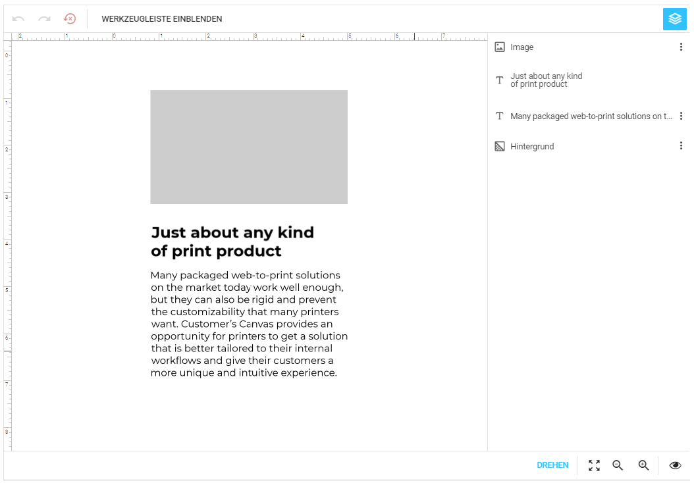

Herzlich Willkommen!
================================================================================

Einführung
--------------------------------------------------------------------------------

Du suchst nach einer simplen Lösung um personalisierte Druckdokumente 
Online generieren zu lassen und möchtest einen Funktionsreichen Editor
verwenden welcher von modernen Browsern (HTML 5) unterstützt wird?

Dann bist Du hier genau richtig! Wir haben ein Plugin für die Shopware
5.5 E-Commerce entwickelt, mit welchem Du Deine Produkte vom Kunden
individualiseren lassen kannst.

Ausgangslage
--------------------------------------------------------------------------------

Das Web2Print Plugin wurde Ursprünglich für die [Schellenberggruppe] entwickelt welche
jahrelange Erfahrung im Digital- sowie Offsetdruck ausweisen können. Ein
Grossunternehmen mit vielen Angestellten inklusive internen Satz und Gestaltung.

Das Plugin kann jedoch in jeder Shopware 5.5 E-Commerce verwendet werden.
Es ist jedoch nicht im Pluginstore erhältich und kann nur von der Pro 
Sales AG angefordert werden: <prosales@pro-sales.ch>.

Die Schellenberggruppe besitzt eine Handvoll an Polygraphen welche für 
die Gestaltung der Druckvorlagen zuständig sind. Diese wollen nicht auf 
die üblichen Gestaltungswerkzeuge wie Adobe Photoshop und Adobe In-Design
verzichten.

Strategische Zielsetzung
--------------------------------------------------------------------------------

Die Schellenberggruppe war auf der Suche nach einer einfachen Lösung 
um professionelle Druckdokumente Online generieren zu lassen. Dabei waren
die Anforderungen jedoch nicht nur ein Textdokument zu personalisieren
sondern auch komplexere Beispiele in 3D wie bspw. Tassen oder Glässer
zu realisieren.

Die Gestaltung soll dabei mithilfe von Adobe Photoshop oder In-Design
realisiert werden. Regeln wie bspw. das Sperren von Bereichen oder Ebenen
können in In-Design definiert werden.

Das Endprodukt ist eine PDF-Datei welche Du herunterladen kannst. Du 
hast volle Kontrolle über das Dokument und kannst bspw. die min. DPI 
für hochgeladene Bilder definieren oder Bereiche für den Druck ausblenden.

[schellenberggruppe]: https://schellenberggruppe.ch/
[https://customerscanvas.com/docs/cc/localization-of-cc.htm]: https://customerscanvas.com/docs/cc/localization-of-cc.htm