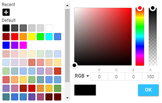
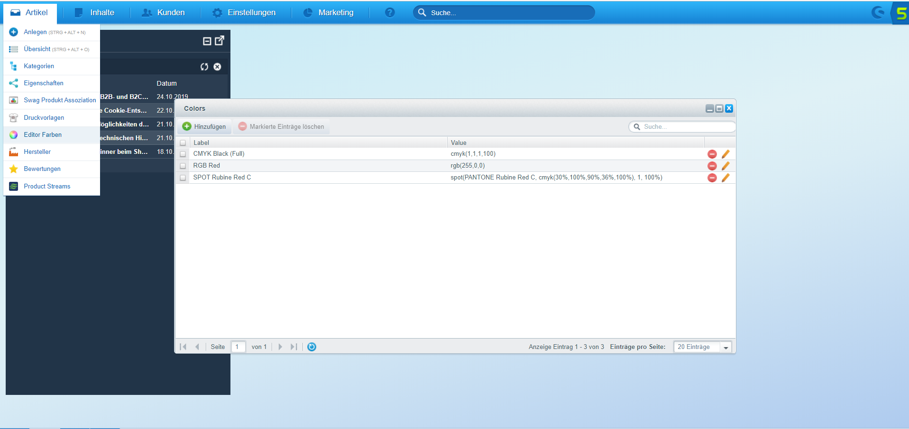
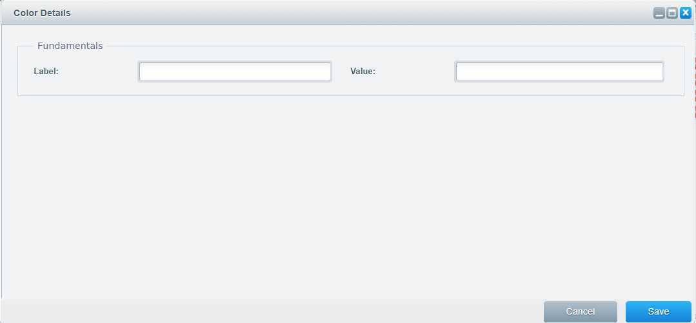
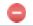
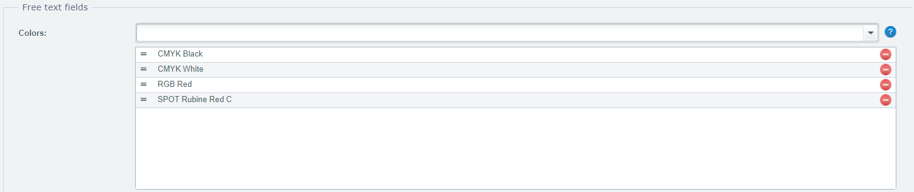

{{$page.title}}
================================================================================

Einleitung
--------------------------------------------------------------------------------

Farben haben eine intensive unbewusste Bedeutung, die jeden von uns beeinflusst. 
Die Wirkung kann individuell sehr unterschiedlich sein. Wir verbinden also Farben 
mit Emotionen und erlebten Ereignissen womit Sie für uns enorm wichtig sind. Und 
natürlich dürfen Sie bei einem professionellen Web2Print Plugin auch nicht einfach 
ausser Acht gelassen werden.

Dem Benutzer werden dabei Farben im Editor angeboten um bspw. Texte oder Flächen 
zu gestalten. Aber wie Du vielleicht bereits schon weisst ist beim Angebot von 
Farben speziell der Farbraum zu beachten und ich hoffe Du weisst was ich damit 
meine. Richtig [RGB] oder [CMYK] sind Beispiele für zwei der bekanntesten 
Ausgabeformate und werden von den meisten Produzenten unterstützt.

Editor Farben
--------------------------------------------------------------------------------

Farben werden im Editor als Farbauswahl Feld (Farbrad) dargestellt:

Auf der linken Seite siehst Du verschiedene vordefinierte Farben welche
dem Kunden zur Auswahl bereitgestellt werden. Diese Farben werden im 
Editor hinterlegt, müssen jedoch zuerst definiert werden, doch dazu
komme ich ein wenig weiter unten.

Daneben erscheint das Farbrad mit verschiedenen Farbtönen die Ausgewählt 
werden können. Unter dem Farbrad kann eine eigene Farbe angelegt werden. 
Dabei ist ersichtlich das im Moment RGB als Farbraum verwendet werden 
soll. Deshalb auch nur die eingeschränkte Eingabe mit den RGB Werten. 
Da es sich um eine Auswahl handelt kann auch in den CMYK Farbraum 
gewechselt werden doch dazu komme ich gleich.

Farbraum
--------------------------------------------------------------------------------

Du weisst nun das der Editor zwei Farbräume (CMYK & RGB) zur Auswahl
bereitstellt. Es gibt jedoch noch einen Dritten undzwar sind das Sonderfarben
([Spot Colors]). Customers Canvas kennt alle drei Farbräume, Sonderfarben
können jedoch nur als vordefinierte Farbe und nicht als Farbraum definiert
werden.

Welchen Farbraum Du zur Verfügung stellen möchtest definierst Du im 
Artikel (`Artikel > Freitext Felder > Farbraum`):

Die Darstellung oben bedeutet das beide Farbräume zur Auswahl bereitgestellt
werden sollen. Du kannst aber natürlich auch nur einen einzelnen Farbraum
hinzufügen, oder das Feld einfach leer lassen. 

Wenn beide Werte hinzugefügt wurden wird der erste Wert priotisiert und im Editor
zuerst als Auswahl angeboten mithilfe eines Auswahlfeldes kann dann aber
in den zweiten Farbraum gewechselt werden. 

Wenn das Feld leer bleibt dann werden beide Farbräume angeboten und CMYK 
prioritiesiert. Also wäre die Einstellung wie oben dargestellt Sinnlos,
da dies bereits der standard Einstellung entspricht.

Editor Farben Fenster
--------------------------------------------------------------------------------

Alle definierten Farben können unter `Artikel > Editor Farben` konfiguriert
werden:

In der Darstellung oben habe ich bereits drei Farben hinterlegt, sie 
können als Referenz verwendet werden.

Neue Farbe Definieren
--------------------------------------------------------------------------------

Öffne das Editor Farben Fenster und klicke bitte auf das grüne Pluszeichen.
Danach öffnet sich ein neues Fenster in welchem Du eine neue Farbe definieren
kannst. Nachdem Du eine Farbe gespeichert hast solltest Du immer das Fenster
schliesssen um eine neue Farbe anzulegen. Falls Du das nicht tust überschreibst
Du Deine Farbe:

### Label

Eine Farbe besteht aus einem eindeutigen Namen (Label) welches zur Identifiezierung
der Farbe dient. Der Wert welcher in `Label` eingetragen wird, wird später
im Artikel in Listenform zur verfügung gestellt. Es ist also lediglich ein
Name der Dir hilft die Farbe später zu identifizieren.

### Value

Das Feld `Value` wird zum defineren des Farbwertes verwendet. Hier wird
der Wert der eigentlichen Farbe gespeichert. Dabei wird eine Zeichenkette
als Farbwert erwartet. Ich gebe Dir einmal ein paar Beispiele:

`cmyk(0,0,0,100)`

**CMYK** Farben werden also innerhalb des `cmyk()` Textkörpers eingetragen. 
Dabei werden die CMYK Werte kommagetrennt hinterlegt, wobei der letzte
Wert kein Komma haben darf. Also `0,0,0,100` bedeutet Cyan = 0, Magenta = 0,
Yellow = 0 und Key = 100. Das Ganze endet dann in einem Schwarz.

`rgb(255,0,0)`

Das selbe Prinzip gilt auch für **RGB** Farben welche jedoch mit `rgb()` 
ummantelt werden. RGB besteht jedoch nur aus drei Farben deshalb werden
auch weniger Werte definiert. `255,0,0` kann somit wie folgt intepretiert
werden: Rot = 255, Grün = 0 und Blau = 0, also ein sattes Rot.

`spot(PANTONE Rubine Red C, cmyk(30%,100%,90%,36%,100%), 1, 100%)`

**Sonderfarben** sind dann schon ein wenig Spezieller sie werden wie üblich
mit `spot()` umziengelt. Eine Sonderfarbe beginnt jedoch mit einem Namen,
hier `PANTONE Rubine Red C`. 

Nach einem Komma folgt der Farbwert und danach folgen nochmals zwei Parameter 
getrennt mit Kommas (1, 100%). 1 ist die **Durchsichtigket** der Farbe. Hier wird 
ein Wert zwischen 0 und 1 also bspw. 0.5 erwartet. Der letzte Wert (100%) 
definiert den **Farbton** welcher verwendet werden soll. 

Doch warum zum Kuckuck hat der CMYK Wert nun Fünf Parameter und nicht 
wie üblich Vier? Nun der letzte Wert also 100% entspricht dem **Alpha Kanal** 
in Prozent und kann generel sowie auch in RGB definiert werden (bei RGB 
wird ein vierter Parameter erwartete bspw. `rgb(255,0,0,50%)`).

Farben Löschen
--------------------------------------------------------------------------------

Du kannst jederzeit Deine Farben löschen. Öffne hierzu das Editor Farben
Fenster. In diesem Fenster kannst Du eine oder mehrere Farben gleichzeitig
entfernen. Sobald Du eine Farbe entfernst wird diese auch gleichzeitig
im Artikel entfernt da diese Farbe nicht mehr existiert also sei bitte
Vorsichtig.

Um mehrere Farben gleichzeitig zu löschen, markiere diese bitte im Fenster
und klicke anschliessend auf die «Markierte Einträge Löschen» Schaltfläche.

Um eine einzelne Farbe zu löschen kannst Du einfach auf das rote entfernen
Zeichen () rechts zum Datensatz anklicken.

Editor Farben
--------------------------------------------------------------------------------

Nun da Du jetzt weisst wo Du Farben definieren kannst (Farbliste), zeige 
ich Dir wie Du diese zur Auswahl bereitstellen kannst. Auch diese 
Einstellung findest Du in Deinem Artikel (`Artikel > Freitext Felder > Farben`):

Alle Farben die Du zuvor angelegt hast stehen nun in der Auswahl zur Verfügung.
Wähle die Farben aus welche Du im Editor verwenden möchtest. Die Sortierung
kann zu jedem Zeitpunkt angepasst werden indem Du die Farbe in die entsprechende
Position rückst:

Natürlich kannst Du auch jederzeit Farben wieder entfernen. Und keine 
Angst wenn Du diese nur im Artikel löschst dann bleibt die Farbe existent
es wird lediglich die Beziehung zwischen dem Artikel und der Farbe gelöscht.

Wenn Du keine Farben hinzufügst stehen dem Kunden auch keine Farben 
zur Auswahl. Der Kunde kann jedoch jederzeit eigene Farben definieren welche 
jedoch nicht in der Farbliste aufgenommen werden.

[spot colors]: https://en.wikipedia.org/wiki/Spot_color
[rgb]: https://en.wikipedia.org/wiki/RGB_color_model
[cmyk]: https://en.wikipedia.org/wiki/CMYK_color_model