{{$page.title}}
================================================================================

Einleitung
--------------------------------------------------------------------------------

Nun da Du nun über die Funktionalität des Plugins bescheid weisst, kommen 
wir nun zum wahrscheinlich wichtigsten Thema, nähmlich das darstellen des 
Editors:

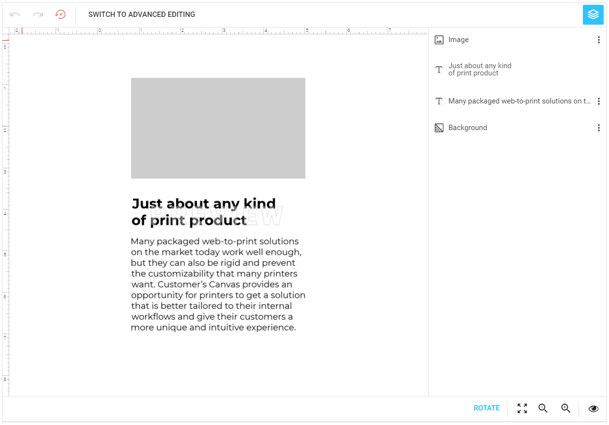

Damit der Editor jedoch etwas anzeigen kann erwartet er zumindest ein 
Design Template. Andere Konfigurationen wie bspw. die Darstellung des 
Editors können mithilfe von den Standardwerten ausseracht gelassen werden.

Wie Du gleich merken wirst stehen Dir eine Menge an Einstellungen zur 
Verfügung, ich werde versuchen diese Einstellungen so gut wie möglich 
zu vermitteln.

Kurzanleitung
--------------------------------------------------------------------------------

Wie bereits in der Einleitung erwähnt braucht es eigentlich gar nicht 
so viele Einstellungen da die meisten Standardwerte so verwendet werden
können (das hoffe ich zumindest). Um so schnell wie möglich ein erstes
Ergebnis zu erzielen müssen wir eigentlich nur den Pfad zum Design Template
hinterlegen.

Dazu öffnest Du einen Artikel: `Artikel > Übersicht` oder `Aritkel > Anlegen`.

Grundsätzlich beginnst Du wie immer. Du erstellst einen Artikel und definierst 
die notwendigen Einstellungen, wie bspw. Preis, Kategorie usw. Eine Einführung wie man ein Produkt anlegt
findest Du in der offiziellen Shopware Dokumentation: [https://docs.shopware.com/de/shopware-5-de/produkte-und-kategorien/produkte-anlegen](https://docs.shopware.com/de/shopware-5-de/produkte-und-kategorien/produkte-anlegen)

Ich gehe nun davon aus dass Du Dir Deinen Artikel angelegt hast und bereits
die Vorschau oder den Artikel sichten kannst. Damit also nun aus dem Artikel
ein Druckprodukt wird müssen wir zwei Einstellungen vornehmen:

**Einstellung-01: Design Template**: Wir kopieren den Hilftext des `Template`
Feldes (`samples/test-page`) in das Feld hinein:

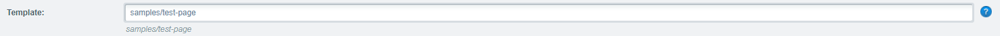

Das Template `assets/designs/samples/test-page` sollte bei der Erstinstallation
von Customers Canvas automatisch mit ausgeliefert werden. Bitte prüfe nocheinmal
ob die Datei auch wirklich existiert. Falls nicht kannst Du Dir die Datei
<a href="https://gitlab.pro-sales.ch/shopware/doc-customers-canvas/wikis/uploads/e82b22d6d0ecbfbf278876d5fc040b73/test-page.psd" target="_self" download>hier herunterladen</a>
und selbst in das entsprechende Verzeichnis ablegen.

**Einstellung-02: Editor Aktivieren**: Nun müssen wir nur noch den Editor
aktivieren und unser erstes Druckprodukt wäre dann fertig:

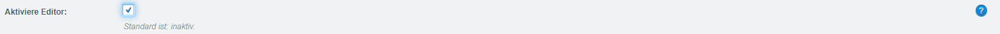

Nachdem Du die Konfigurationen wie oben beschrieben gesetzt hast kannst
Du den Editor öffnen dabei solltest Du zur Vorschau in der Einleitung 
gelangen. Wie Du siehst braucht es keine wilden Konfigurationen um 
schnell zum Ergebnis zu gelangen. Mit nur zwei Klicks erhälst Du Dein
erstes Druckprodukt.

Artikel Konfigurationen
--------------------------------------------------------------------------------

In Wahrheit warten eine Menge Einstellungsmöglichkeiten betreffend dem
Editor auf Dich. Dank der Oberfläche (Interface) solltest Du bequem und 
einfach neue Druckprodukte in allen Varianten kreiieren können. Alle 
Einstellungen betreffend des Editors werden im Artikel unter `Freitextfelder`
dargestellt.

### Farben

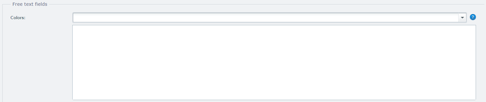

Das Thema Farben behandle ich im [Farben](../colors/) Kapitel. Bitte
lese das Kapitel durch um zu verstehen wie Farben im Plugin funktionieren.

Bevor Du das Farben Feld verwenden kannst musst Du zuerst Farben definieren
(`Artikel > Editor Farben`). Mehr hierzu findest Du in dem vorhin erwähnten
Kapitel. Alle Farben welche in der Farbliste definiert wurden stehen
in diesem Auswahlfeld nun zur Verfügung:

Alle Farben welche Du in diesem Feld auflistest werden im Editor als
vordefinierte Farbe zur Auswahl angeboten. Die Reihenfolge kann dabei
beliebig angepasst werden, denn genauso werden die Farben auch später
im Editor sortiert.

### Farbraum

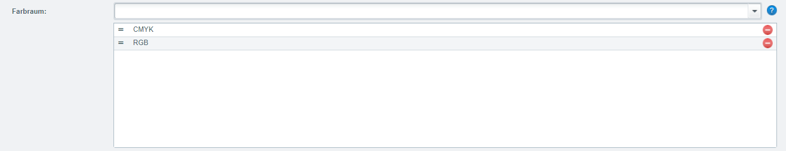

Auch im zweiten Feld findest Du mehr Informationen im [Farben](../colors/) 
Kapitel. Bitte lese das Kapitel durch um zu verstehen wie Farben im Plugin 
funktionieren.

Neben den vordefinierten Farben kannst Du auch den Farbraum definieren
welcher im Editor verwendet werden soll. Dazu kannst Du das Auswahlfeld
Farbraum verwenden:

Es stehen Dir zwei Werte zur Verfügung: `CMYK` &  `RGB`. Der erste 
Farbraum (im Beispiel oben ist dies `CMYK`) wird im Editor priorisiert
behandelt. Dies bedeutet das beim eingeben von eigenen Farben immer 
zuerst der entsprechende Farbraum verwendet werden soll.

Wenn das Feld leer bleibt dann werden beide Farbräume angeboten und CMYK 
prioritiesiert. Also wäre die Einstellung wie oben dargestellt Sinnlos,
da dies bereits der standard Einstellung enspricht.

### Template

Das erste Feld erwartet einen relativen Pfad zur Template Datei. Das kann 
entweder eine Photoshop (`.psd`) oder InDesign (`.idml`) Datei sein. Wichtig ist das Du die 
Datei in Deinem `assets/designs/` Verzeichnis Deiner Customers Canvas 
Anwendung hinterlegst.

### Template Position

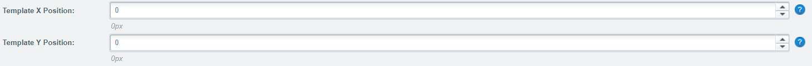

Du kannst ebenfalls die X und Y Position für das Template definieren.
Dabei wird eine Nummer für die Koordinaten in Pixel erwartet. Diese 
Funktion greift jedoch nur wenn das Template einen Hintergrund oder eine
Maske verwendet. Das Template wird dann relativ zum Hintergrund oder
der Maske mit den eingetragenen Koordinaten platziert. 

Wenn das Feld leer bleibt werden 0 Pixel als Standard verwendet.

### Modus

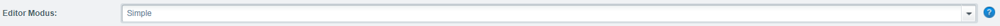

Mithilfe des `Editor Modus` Feldes kannst Du die Darstellung des Editors beiinflussen.
Es stehen Dir dabei drei Auswahlmöglichkeiten zur Verfügung:

**Simple**: Dies ist die Standard Einstellung. Der Editor hat dabei die
Toolbox eingeklappt. Die Toolbox lässt sich jedoch jederzeit wieder 
einblenden. Wenn die Toolbox eingeblendet wurde, lässt sie sich jedoch
nicht wieder zu klappen.

**SimpleOnly**: Die zweite Option erlaubt es Dir die Toolbox zu deaktivieren.
Bei dieser Option hat der Kunde keine Möglichkeit die Toolbox einzublenden
und kann somit keine eigenen Elemente platzieren.

**Advanced**: Die letzte Option erlaubt es die Toolbox bereits zu beginn
anzeigen zu lassen.

### Schriften

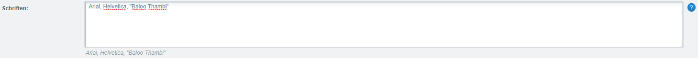

Das Thema Schriften behandle ich ausführlich im [Schriften](../fonts/) 
Kapitel. Bitte lese das Kapitel durch um zu verstehen wie Schriften im 
Plugin funktionieren.

Das Schriften Textfeld erwartet die gewünschten Schriften komma getrennt,
wobei der letzte Wert kein Komma haben darf.

Die Eingabe entspricht dabei den Namen der Schriftdatei welche Du im
`assets/fonts/` Verzeichnis hinterlegt hast.

Dateinamen welche leerzeichen enthalten müssen mit Hochkommata maskiert
werden, also bspw. `"Neue Helvetica STD"`.

### Toolbox

Die hundert und eine Option um ein Toolbox Element zu aktivieren, helfen
Dir den Editor individuell mit neuer Funktionalität auszustatten. Ein
Toolbox Element wird dabei im Editor auf der Linken Seite dargestellt,
es existieren jedoch verschiedene Elemente:

#### Hintergrund

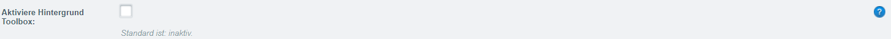

Wenn Du dieses Auswahlfeld aktivierst wird das Hintergrund Toolbox Element
im Editor dargestellt:

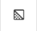

#### Absatz

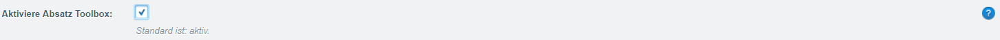

Wenn Du dieses Auswahlfeld aktivierst wird das Absatz Toolbox Element
im Editor dargestellt:

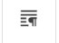

#### Ellipse

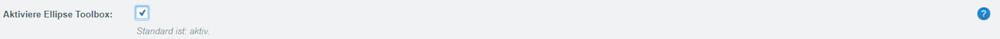

Wenn Du dieses Auswahlfeld aktivierst wird das Ellipse Toolbox Element
im Editor dargestellt:

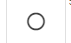

#### Bild

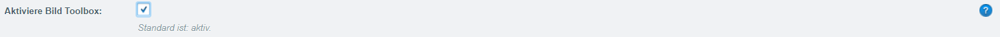

Wenn Du dieses Auswahlfeld aktivierst wird das Bild Toolbox Element
im Editor dargestellt:

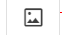

#### Linien

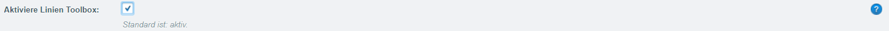

Wenn Du dieses Auswahlfeld aktivierst wird das Linien Toolbox Element
im Editor dargestellt:

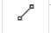

#### Liniear Barcode

Wenn Du dieses Auswahlfeld aktivierst wird das Linear Barcode Toolbox Element
im Editor dargestellt:

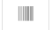

#### QrCode

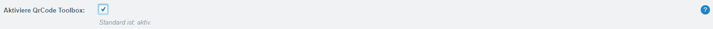

Wenn Du dieses Auswahlfeld aktivierst wird das QrCode Toolbox Element
im Editor dargestellt:

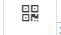

#### Rechteck

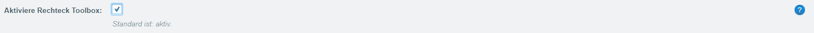

Wenn Du dieses Auswahlfeld aktivierst wird das Rechteck Toolbox Element
im Editor dargestellt:

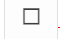

#### Rich Text

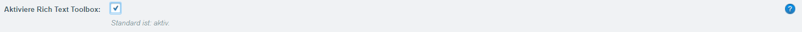

Wenn Du dieses Auswahlfeld aktivierst wird das Rich Text Toolbox Element
im Editor dargestellt:

#### Text

Wenn Du dieses Auswahlfeld aktivierst wird das Text Toolbox Element im Editor dargestellt:

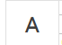

### Wasserzeichen

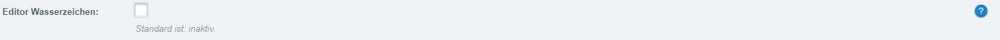

Wenn Du dieses Auswahlfeld aktivierst wird das Wasserzeichen im Editor dargestellt:

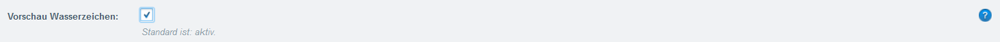

Wenn Du dieses Auswahlfeld aktivierst wird das Wasserzeichen in der Vorschau dargestellt:

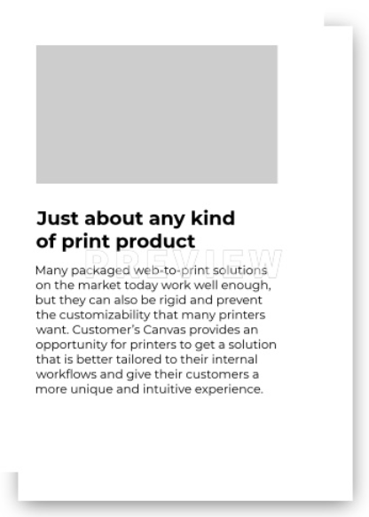

### Editor Aktivieren

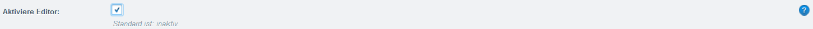

Dieses Feld solltest Du bereits seit der Einleitung oder Mein erster Editor
kennen.

Wenn Du dieses Auswahlfeld aktivierst wird der Editor dargestellt.

### Sprache

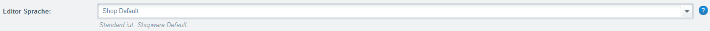

Dein Editor kannst Du in verschiednen Sprachen ausgeben lassen. Mithilfe
des `Editor Sprache` Auswahlfeldes kannst Du bestimmen in welcher Sprache
der Editor ausgegeben werden soll. Falls die Sprache nicht existiert wird
Englisch als Standardsprache vewendet.

Die Standard Auswahl `Shop Default` bedeutet dass die Sprache des Shopanwenders
übernommen werden soll.

### Min. DPI

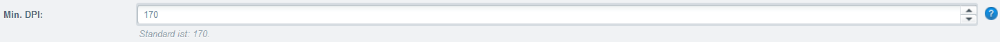

Im Feld `Min. DPI` legst Du die minimum Auflösung in DPI (Dots Per Inches)
fest. Diese Auflösung wird von allen Bildmaterialen welche im Design Template
hinterlegt oder hochgeladen wurden erwartet.

Falls der Wert die min. DPI unterschreitet wird eine Warnmeldung ausgegeben:

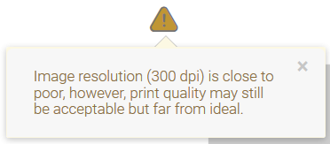

Die intesivität der Fehlermeldung variiert dabei anhand wie weit der 
Wert von der min. DPI entfernt ist:

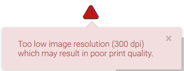

Egal ob nun eine Warn- oder Fehlermeldung angezeigt wird, dies hat keinen
Einfluss auf die Bestellbarkeit. Kunden können auch mit Fehlermeldungen
bestellen. Es soll lediglich den Kunden informieren das etwas mit dem
Bild nicht korrekt zusein scheint.

### Hintergrund

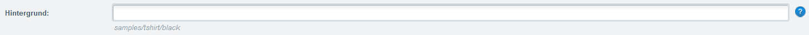

Optional kannst Du Deinem Design Template ein Hintegrund hinterlegen welcher
innerhalb des Editors dargestellt werden soll. Falls Du das Design Template
an einer bestimmten Position ausgeben möchtest kannst Du das mithilfe der
[Template Position](#template-position) lösen. Mehr zu Hintegrundbilder findest
Du unter: [Komponenten > Druckprodukte](../print/product/)

### Maske

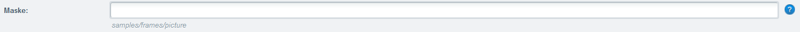

Optional kannst Du Deinem Design Template eine Maske übergeben welche
innerhalb des Editors dargestellt werden soll. Falls Du das Design Template
an einer bestimmten Position ausgeben möchtest kannst Du das mithilfe der
[Template Position](#template-position) lösen. Mehr zu Masken findest
Du unter: [Komponenten > Druckprodukte](../print/product/)

### Vorschau

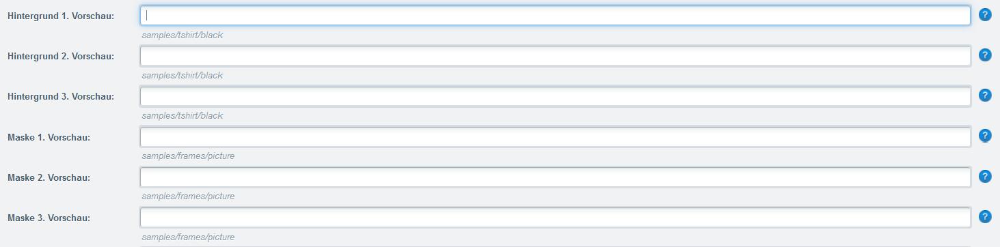

Optional kannst Du verschiedene Vorschauen generieren lassen. Mithilfe
der Felder welche oben dargestellt werden kannst Du die Masken und Hintergrundbilder
für die Vorschauen definieren. Mehr zu den Vorschauen findest
Du unter: [Komponenten > Druckprodukte > Vorschau](../print/product/#vorschau).

### Zusätzliche Templates

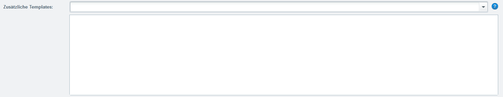

Optional kannst Du hier weitere Seiten definieren die im Editor angezeigt 
werden sollen. Dabei musst Du aber zuerst ein Template anlegen, mehr zu 
diesem Thema findest Du unter: [Modules > Druckvorlagen](../print/templates/).

Wähle einfach die Druckvorlagen aus welche Du im Editor darstellen möchtest.
Die Reihenfolge ist dabei dieselbe wie Du sie zuweist. Du kannst jederzeit
die Position der Druckvorlagen ändern.

## Warenkorb

Sobald der Kunde mit dem bearbeiten fertig ist, wird das Produkt in den
Warenkorb verschoben. Zu diesem Zeitpunkt wurde bereits ein Editor
State File generiert und in der Datenbank abgespeichert.

Die Warenkorbfunktion wurde dabei ein wenig angepasst, denn normalerweise
summiert Shopware die Auflage bei den selben Produkten anstelle einer 
neuen Position zu generieren. Dies bedeutet falls Du den Artikel "T-Shirt"
mit einer Auflage von 5 Stück bestellt hast und nun ein weiteres T-Shirt
hinzufügst wird die Auflage nicht auf 6 Stück erhöht sondern eine eigene
Position angelegt.

Im Warenkorb stehen jedoch ansonsten die Standardfunktionalität von Shopware
zur Verfügung. Der Kunde kann also bspw. die Auflage ändern oder Positionen aus
dem Warenkorb wieder entfernen.

## Bestellung

Sobald der Kunde alle Warenkorbpositionen zusammengetragen hat wird 
die Bestellung ausgelöst. Dabei wurden eigentlich keine Änderungen 
vorgenommen das einzige was passiert ist das der Datenbankeintrag mit
dem Editor State File aktualisiert wird. Dabei wird die Relation zum
Warenkorb entfernt und für die Relation zur Bestellübersicht gesetzt.

Das HighEnd PDF findest Du in den Bestelldetails unter Positionen:

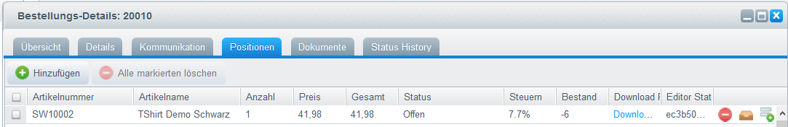

Achte auf die Spalte "Download PDF" sowie "Editor State".

### Spalten Einblenden

Sollten diese Spalten aus irgendwelchen Gründen nicht erscheinen versuche
die Spalte einzublenden:

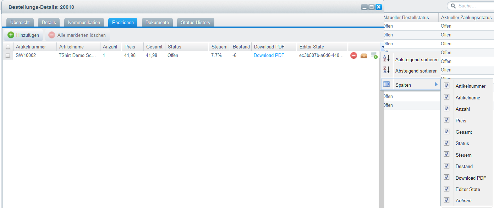

## Editor State Files

Immer wenn das Produkt in den Warenkorb abgelegt wird wird im Hintergrund
die [`saveProduct`] oder [`finishProductDesign`] Funktion des Customers Canvas
Editors aufgerufen. Sobald einer dieser Funktionen aufgerufen wird teilen
wir Customers Canvas mit das wir mit dem Gestalten fertig sind. Customers
Canvas erstellt dabei ein sogenanntes State File welches alle Einstellungen
für den Editoren speichert. Darin ist alles gespeichert um den Editor auf
den gespeicherten Status zurückzusetzen also bspw. der Benutzer, die eingetragenen
Daten, Positionen usw.

Diese Datei wird normalerweise im `userdata/«BENUTZER»/states/` Verzeichnis
Deiner Customers Canvas Anwendung hinterlegt. Editor State Files werden 
nicht automatisch gelöscht und müssen manuell entfernt werden falls dies
notwendig sein sollte.

[`saveProduct`]:        https://customerscanvas.com/docs/cc/customerscanvas.iframeapi.editor.saveproduct.htm
[`finishProductDesign`]: https://customerscanvas.com/docs/cc/customerscanvas.iframeapi.editor.finishproductdesign.htm