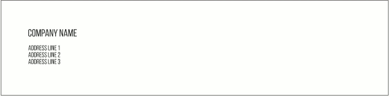
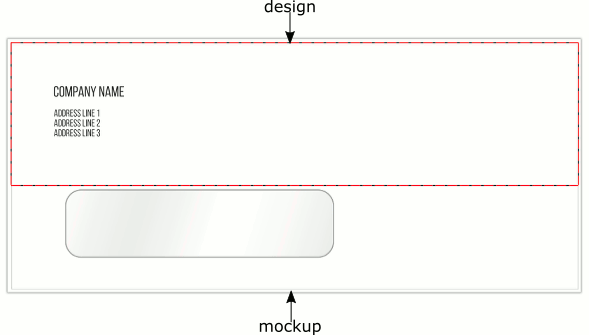
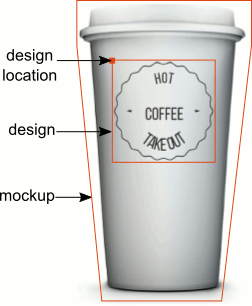
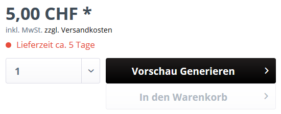

{{$page.title}}
================================================================================

Einleitung
--------------------------------------------------------------------------------

Aus Sicht von Customers Canvas ist ein Druckprodukt ein Artikel zur Druckproduktion,
wie bspw. Visitenkarten, T-Shirts oder ähnliches. Und wie Du Dir sicherlich
vorstellen kannst existieren eine Vielzahl an Möglichkeiten ein Druckprodukt
darzustellen. Oftmals fokusiert man sich aber zu stark auf die Druckproduktion 
und vergisst dabei alle weiteren Faktoren die eine wichtige Rolle spielen, 
wie bspw. der Preis, die Varianten und so weiter. Aber um Dich nicht gleich
zu beginn abzuschrecken fokusiere ich mich in diesem Beitrag nur um das 
Druckprodukt selbst - also wie werden Templates aufgebaut und welche Bestandteile
existieren.

Design Templates
--------------------------------------------------------------------------------

Das Design Template ist das Herzstück Deines Druckproduktes. Im Design
Template werden alle Elemente abgelegt welche für das HighEnd PDF zur 
Produktion dargestellt werden. 
Dabei kannst Du Deine Templates entweder in PhotoShop (`.psd`) oder in 
InDesign (`.idml`) gestalten.

Alle Design Templates werden im Unterverzeichnis `assets/designs/`
Deiner Customers Canvas Anwendung hinterlegt. In diesem Verzeichnis 
kannst Du weitere Unterverzeichnise anlegen falls Du dies wünscht. 
Später im Artikel brauchst Du den relativen Pfad zum Design Template,
also merk Dir Deine Struktur oder schreib Dir den Pfad auf.

Hier siehst Du ein einfaches Design - ein Label für Adressen:

Das Design File ist dabei ziehmlich Nackt, es werden also keine Hintergrundbilder
oder Masken verwendet um den Kunden nicht zu verwirren oder um die Ausgabe
des HighEnd PDF zu optimieren.

Du kannst natürlich auch Hintergrundbilder oder Masken verwenden, dabei
musst Du aber stehts die Ausgabe des HighEnd PDF im Hinterstübchen behalten.
Wenn Dein Produzent also mit Hintergrundbildern oder Masken arbeiten kann, 
dann fühl Dich frei diese im Design Template zu hinterlegen. Kurz gesagt
was Rein kommt kommt auch wieder Raus.

MockUp's
--------------------------------------------------------------------------------

Customers Canvas stellt Dir nicht nur den Editor zur Verfügung sondern 
Du kannst auch verschiedene Vorschauen generieren lassen. Eventuell möchtest
Du gewisse Bereiche für das HighEnd PDF wie bspw. Hintegrundbilder oder 
Masken ausblenden. Nehmen wir einmal das Beispiel von vorhin in welchem
wir ein Adresslabel für ein Couvert erstellt haben. Vielleicht möchtest
Du im Editor das Fenster als Maske und eventuell das Couvert als Hintergrundbild
darstellen. Im HighEnd PDF dürfen diese Elemente aber nicht angezeigt 
werden und genau das erreichst Du mit MockUp's.

Ein MockUp wird somit für die visuelle Darstellung für den Endkunden 
verewendet. Dabei kannst Du selbst entscheiden ob Du diese Elemente
als PhotoShop oder als Bilddatei hinterlegst (`.psd`, `.png`, `.jpeg`, 
`.jpg`, `.svg`, `.pdf`, `.tiff`, `.gif`). Alle MockUp Dateien müssen sich
innerhalb des `assets/mockups/` Verzeichnis befinden. Auch hier kannst Du
natürlich weiter Unterverzeichnise anlegen. Ich empfehle bspw. ein Unteverzeichnis
für Masken (`assets/mockups/masks/`) und eins für Hintergrundbilder oder aus meiner Sicht
Materialien (`assets/mockups/materials/`).

Design Platzierung
--------------------------------------------------------------------------------

Wenn Du ein MockUp verwendest möchtest Du eventuell auch das Design Template
platzieren. Deshalb hast Du die Möglichkeit die X und Y Position für das
Design Template zu definieren. Diese Optionen greifen aber auch nur dann,
wenn auch wirklich ein MockUp definiert wurde. So kannst Du jederzeit 
Dein Design auf die gewünschte Position schieben.

DPI Auflösung
--------------------------------------------------------------------------------

Die Standard Messeinheit in Customers Canvas sind Punkte (points),
wobei 1 Punkt 1/72 eines Inches entspricht. Punkte werden also für 
Positionsbestimmungen oder Grössenangaben verwendet.

Wenn Du also ein MockUp erstellst, solltest Du Dich nicht an den Pixelwerten
Deines Bildes orientieren. Natürlich spielt die Auflösung eine wichtige 
Rolle beim Positionieren. Customers Canvas intepretiert alle Positionsangaben
als Punkte.

**Als Beispiel**: Wenn dein Design Template in 250 DPI (DPI = Dots per Inches)
mit einer Arbeitsfläche von 500 x 500 Pixeln arbeitet. Und Dein MockUp nun aber in der selben Grösse
(500 x 500) angelegt wurde aber nur 100 DPI verwendet, dann 
kannst Du diese Dateien nicht übereinander legen da diese unterschiedliche
Grössen verwenden. Die Berechnung der Endgrössen fällt dabei wie folgt aus:

- Design Template = 500 pixels / 250 dots per inch x 500 pixels / 250 dots per inch = 2 x 2 inches = 144 x 144 points
- MockUp = 500 pixels / 100 dots per inch x 500 pixels / 100 dots per inch = 5 x 5 inches = 360 x 360 points

Der einfachheitshalber empfehlen wir Dir immer mit einheitlichen Auflösungen
und Messeinheiten zu arbeiten.

::: tip Ändern der Auflösung im PhotoShop
Falls Du Dein MockUp als zu gross oder zu klein empfindest, dann solltest 
Du den DPI Wert ändern. In PhotoShop kannst Du diese Einstellung unter:
`Bild > Bildgrösse` definieren. Änder den Wert für die Auflösung.

Customers Canvas intepertiert SVG Bilder mit einer Auflösung von 72 DPI.
:::

Vorschau
--------------------------------------------------------------------------------

Du kannst selbst entscheiden ob Du dem Kunden eine Vorschau zur Verfügung 
stellen möchtest oder nicht. Grundsätzlich gilt dasselbe Prinzip wie für 
MockUp's. Du hast also entweder ein Hintergrundbild oder eine Maske welche
Du über/unter das Design Template legen möchtest.

Wir haben jedoch eine Limit von drei Vorschauen definiert. Dies bedeutet dass
Du drei verschiedene Ansichten anzeigen lassen kannst. Wenn Du also bspw.
eine Tasse personalisieren möchtest, brauchst Du eventuell eine Möglichkeit
eine Rundumansicht für den Kunden generieren zu lassen, um sein Produkt anzusehen.
Somit können wir bspw. dem Kunden eine Front, eine Ansicht von Links und 
eine Ansicht von Rechts zur Verfügung stellen. Wie Du dabei Dein Template
aufbauen musst kannst Du aus der offiziellen Customers Canvas Dokumentation:
[https://customerscanvas.com/docs/cc/3d-preview.htm](https://customerscanvas.com/docs/cc/3d-preview.htm) 
entnehmen.

Sobald eine Vorschau definiert wurde wechseln die Schaltflächen des Artikels:

Dabei kann das Druckprodukt erst nach der Vorschau in den Warenkorb gelegt werden.

Markers
--------------------------------------------------------------------------------

[Markers] sind Ebenennamen (PSD) oder Elementnamen (IDML) um Regeln zu
definieren. Mit Markers kannst Du bspw. das editieren unterbinden
oder das verschieben des Elements sperren. Es existieren eine Vielzahl
an vordefinierten Regeln, bitte mache Dich damit vertraut:
[https://customerscanvas.com/docs/cc/supported-markers.htm][markers].

[markers]: https://customerscanvas.com/docs/cc/supported-markers.htm
