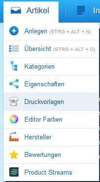
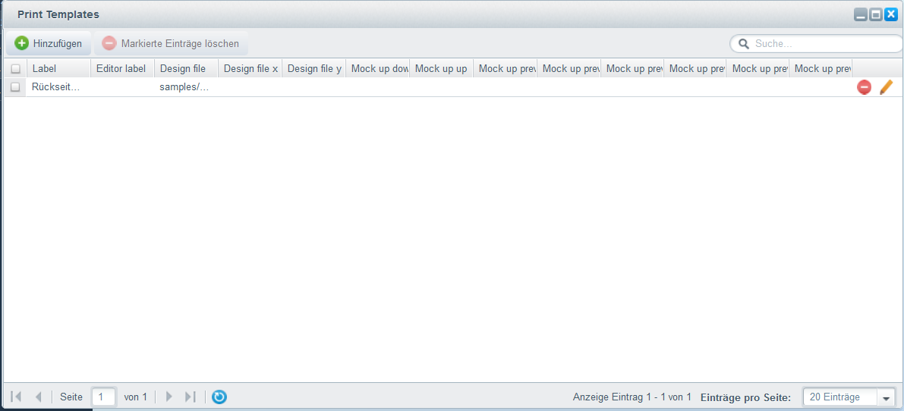
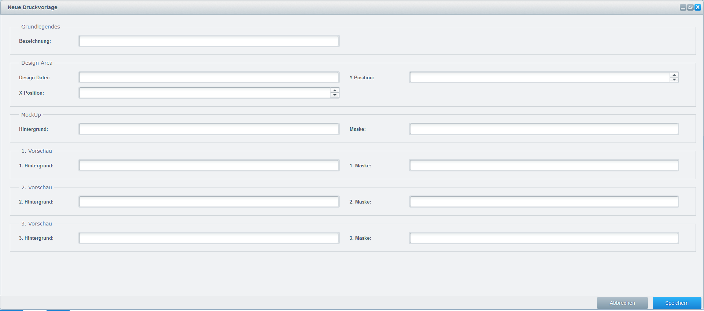
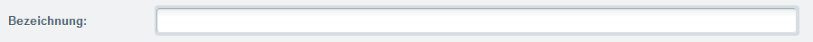
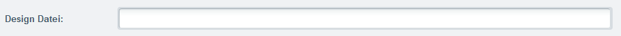
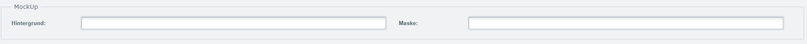
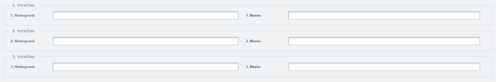
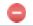
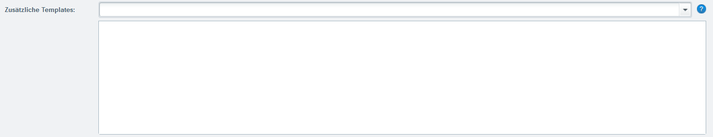

{{$page.title}}
================================================================================

Einleitung 
--------------------------------------------------------------------------------

Druckvorlagen werden genutzt um dem Editor zusätzliche Seiten zur Verfügung
zu stellen. Dabei unterscheidet sich die Konfiguration des Editors nur 
geringfügig von den Konfigurationen für Druckvorlagen.

Alle Druckvorlagen findest Du unter: `Artikel > Druckvorlagen`.

Fenster
--------------------------------------------------------------------------------

In der Übersicht der Druckvorlagen findest Du alle erstellten Druckvorlagen
und kannst diese bearbeiten, löschen oder neue hinzufügen.

### Neue Druckvorlage

Neue Druckvorlagen kannst Du im Druckvorlagen Fenster (`Artikel > Druckvorlagen`)
anlegen. Klicke hierzu auf die Hinzufügen Schaltfläche. Ein neues
Fenster öffnet sich:

Hier trägst Du alle Attribute der Druckvorlage ein.

#### Bezeichnung

Die Bezeichnung hilft Dir Deine Druckvorlage in der Auswahl zu identifizieren.
Der Namen welchen Du in diesem Feld einträgst wird in der Druckvorlagenliste
des Editors dargestellt.

#### Design Datei

Hier trägst Du den relativen Pfad zum Template ein. Der Pfad ist dabei 
relativ zu Deinem `assets/designs/` Verzeichnis Deiner Customers Canvas
Anwendung.

#### Design Position

Du kannst ebenfalls die X und Y Position für das Template definieren.
Dabei wird eine Nummer für die Koordinaten in Pixel erwartet. Diese 
Funktion greift jedoch nur wenn das Template einen Hintergrund oder eine
Maske verwendet. Das Template wird dann relativ zum Hintergrund oder
der Maske mit den eingetragenen Koordinaten platziert. 

Wenn das Feld leer bleibt werden 0 Pixel als Standard verwendet.

#### MockUp

Optional kannst Du Deinem Design Template ein Hintegrund und eine Maske hinterlegen. Falls Du das Design Template
an einer bestimmten Position ausgeben möchtest kannst Du das mithilfe der
[Design Position](#design-position) lösen. Mehr zu Hintegrundbilder und Masken findest
Du unter: [Komponenten > Druckprodukte](../product/)

#### Vorschauen

Optional kannst Du verschiedene Vorschauen generieren lassen. Mithilfe
der Felder welche oben dargestellt werden kannst Du die Masken und Hintergrundbilder
für die Vorschauen definieren. Mehr zu den Vorschauen findest
Du unter: [Komponenten > Druckprodukte > Vorschau](../product/#vorschau).

Druckvorlagen Löschen
--------------------------------------------------------------------------------

Um Druckvorlagen endgültig zu löschen musst Du das Druckvorlagen Fenster
öffnen. In diesem Fenster kannst Du entweder einzelne oder mehrere Druckvorlagen
gleichzeitig löschen.

Um mehrere Farben gleichzeitig zu löschen, markiere diese bitte im Fenster
und klicke anschliessend auf die «Markierte Einträge Löschen» Schaltfläche.

Um eine einzelne Farbe zu löschen kannst Du einfach auf das rote entfernen
Zeichen () rechts zum Datensatz anklicken.

Druckvorlagen Editieren
--------------------------------------------------------------------------------

Alle erstellten Druckvorlagen werden im Druckvorlagen Fenster aufgelistet.
Du kannst jederzeit die Attribute für eine Druckvorlage editieren indem
Du auf das bearbeiten Symbol ()
klickst.

Druckvorlagen Zuweisen
--------------------------------------------------------------------------------

Um Druckvorlagen Deinem Editor zuzuweisen musst Du den Artikel zuerst 
öffnen (`Artikel > Übersicht` oder `Aritkel > Anlegen`). Unter `Freitextfelder`
findest Du dann das Zusätzliche Templates Feld:

Wähle einfach die Druckvorlagen aus welche Du im Editor darstellen möchtest.
Die Reihenfolge ist dabei dieselbe wie Du sie zuweist. Du kannst jederzeit
die Position der Druckvorlagen ändern.

Der Nachteil
--------------------------------------------------------------------------------

Auch wenn es aus Sicht des Shopanwenders eine angehneme Lösung zur Orginasition
von Druckvorlagen zu sein scheint birgt diese Arbeitsweise einen Nachteil.
Wenn Du nähmlich Artikel Varianten generierst musst Du mit zwei Fenstern
gleichzeitig arbeiten. In dem einen Fenster erstellst Du die Druckvorlage
und im anderen weisst Du es der entsprechenden Variante zu. 

Wenn Du nur
mit den Artikel Attributen arbeiten würdest dann könntest Du die [Konfigurationsvorlagen]
verwenden. Dieser hilft Dir gewisse Werte für die Aritkel Variante automatisch 
zu hinterlegen. Bspw. weisst Du bereits das alle Artikel Varianten das 
selbe Design File verwenden und lediglich die Vorschauen angepasst werden
müssen. Also hinterlegst Du den Wert zum Design File automatisch für alle
generierten Artikel Varianten - das spart enorm viel Zeit.

Doch wie bereits erwähnt kannst Du nur Artikel Attribute in der Konfigurationsvorlage
verwenden. Dies ist auch der Grund weshalb die erste Druckvorlage im Artikel
angelegt wird und nicht in den Druckvorlagen wie die anderen Seiten.

[konfigurationsvorlagen]: https://docs.shopware.com/de/shopware-5-de/produkte-und-kategorien/varianten#set-abhaengigkeiten
