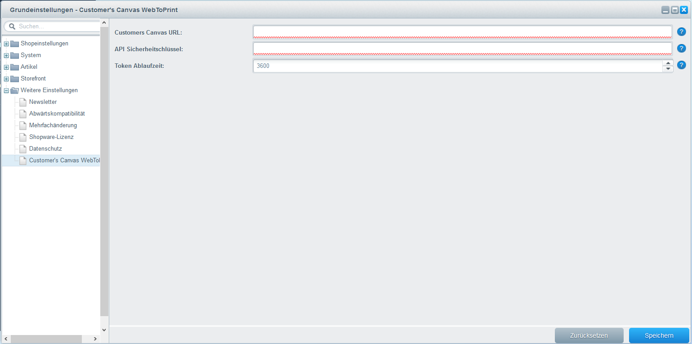
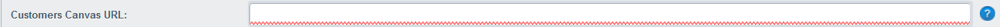
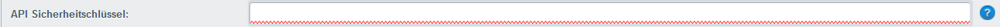

{{$page.title}}
================================================================================

Alle Konfigurationen zum Plugin findest Du unter: `Einstellungen > 
Grundeinstellungen > Weitere Einstellungen > Customer's Canvas WebToPrint`:



Customer's Canvas URL
--------------------------------------------------------------------------------



Hier trägst Du die URL zu Deiner Customer's Canvas Anwendung ein. Bitte
achte darauf das Protokoll des Shops bspw. HTTP oder HTTPS mit dem Protokoll
Deiner URL übereinstimmt, sofern dies möglich ist. Wenn Dein Shop also mit 
dem HTTPS Protokoll arbeitet sollte auch das Skript in HTTPS eingebunden 
werden. Die URL sollte ohne Slash beendet werden also bspw. `https://google.com`.

API Sicherheitsschlüssel
--------------------------------------------------------------------------------



Der API Sicherheitsschlüssel wird zur Authentifizierung der Web API Anfragen
benötigt. Ohne Sicherheitsschlüssel kann das Plugin nicht mit Deiner Customers
Canvas Anwendung kommunizieren.

Der Sicherheitsschlüssel muss mit dem gesetzten Wert `ApiSecurityKey` 
in der `Configuration\AppSettings.config` Datei Deiner Customers Canvas
übereinstimmen.

```xml
<appSettings>
    <add key="ApiSecurityKey" value="UniqueSecurityKey" />
</appSettings>
```

Token Ablaufzeit
--------------------------------------------------------------------------------


Trage hier die Lebensdauer des Tokens in Sekunden ein. Standard sind 3600 
Sekunden (3600 / 60 = 60 Minuten). Sobald die Lebensdauer des Tokens abgelaufen 
ist, wird ein neuer Token generiert. Du musst Dich aber nicht um die Tokens 
sorgen da diese automatisch neu generiert werden.
