# {{$page.title}}

## Einleitung

## Artikel Konfigurationen

### Farben

Das Thema Farben behandle ich im [Farben](../colors/) Kapitel. Bitte
lese das Kapitel durch um zu verstehen wie Farben im Plugin funktionieren.

Bevor Du das Farben Feld verwenden kannst musst Du zuerst Farben definieren
(`Artikel > Editor Farben`). Mehr hierzu findest Du in dem vorhin erwähnten
Kapitel. Alle Farben welche in der Farbliste definiert wurden stehen
in diesem Auswahlfeld nun zur Verfügung:

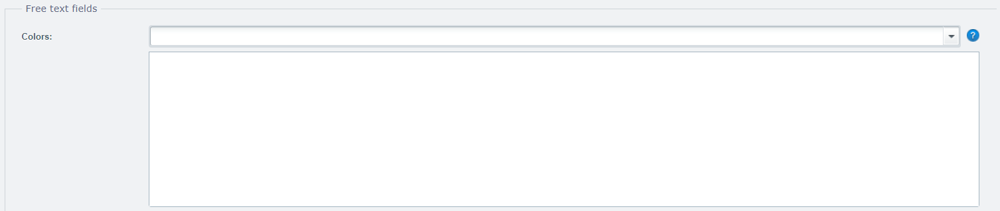

Alle Farben welche Du in diesem Feld auflistest werden im Editor als
vordefinierte Farbe zur Auswahl angeboten. Die Reihenfolge kann dabei
beliebig angepasst werden, denn genauso werden die Farben auch später
im Editor sortiert.

### Farbraum

Auch im zweiten Feld findest Du mehr Informationen im [Farben](../colors/) 
Kapitel. Bitte lese das Kapitel durch um zu verstehen wie Farben im Plugin 
funktionieren.

Neben den vordefinierten Farben kannst Du auch den Farbraum definieren
welcher im Editor verwendet werden soll. Dazu kannst Du das Auswahlfeld
Farbraum verwenden:

Es stehen Dir zwei Werte zur Verfügung: `CMYK` &  `RGB`. Der erste 
Farbraum (im Beispiel oben ist dies `CMYK`) wird im Editor priorisiert
behandelt. Dies bedeutet das beim eingeben von eigenen Farben immer 
zuerst der entsprechende Farbraum verwendet werden soll.

Wenn das Feld leer bleibt dann werden beide Farbräume angeboten und CMYK 
prioritiesiert. Also wäre die Einstellung wie oben dargestellt Sinnlos,
da dies bereits der standard Einstellung enspricht.

### Template

Das Template ist das Herzstück es bildet die Zeichenfläche welche 
im Editor zur Verfügung gestellt wird. Hier kannst Du Deiner kreativität
"fast" uneingeschränkt freien Lauf lassen. 

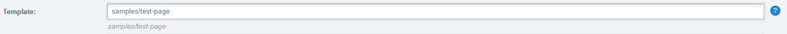

Das erste Feld erwartet einen relativen Pfad zur Template Datei. Das kann 
entweder eine Photoshop oder InDesign Datei sein. Wichtig ist das Du die 
Datei in Deinem `assets/designs/` Verzeichnis Deiner Customers Canvas 
Anwendung hinterlegst.

Du kannst beliebig viele Unterverzeichnisse im `assets/designs/` Verzeichnis
anlegen um Deine Templates zu organisieren. Wenn Du also Deine Template
Datei unter: `assets/designs/tshirts/blanko_male.psd` abgelegt hast, 
musst Du: `tshirts/blanko_male` eintragen. Ob Du die Dateierweiterung
angeben möchtest (also bspw. `.psd`) oder nicht ist Dir überlassen. Wenn
Du zwei Dateien mit dem selben Namen verwendest wird die PhotoShop Datei
priorisiert.

Ein Template muss entweder eine PhotoShop (`.psd`) oder InDesign (`.idml`)
Datei sein.

Du kannst ebenfalls die X und Y Position für das Template definieren.
Dabei wird eine Nummer für die Koordinaten in Pixel erwartet. Diese 
Funktion greift jedoch nur wenn das Template einen Hintergrund oder eine
Maske verwendet. Das Template wird dann relativ zum Hintergrund oder
der Maske mit den eingetragenen Koordinaten platziert. 

Wenn das Feld leer bleibt werden 0 Pixel als Standard verwendet.

### Modus

Die Darstellung des Editors lässt sich einfach beiinflussen, indem Du
den gewünschten Modus einfach auswählst:

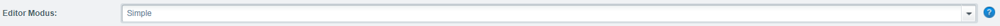

Es stehen drei Optionen zur Verfügung:

**Simple**: Dies ist die Standard Einstellung. Der Editor hat dabei die
Toolbox eingeklappt. Die Toolbox lässt sich jedoch jederzeit wieder 
einblenden. Wenn die Toolbox eingeblendet wurde, lässt sie sich jedoch
nicht wieder zu klappen.

**SimpleOnly**: Die zweite Option erlaubt es Dir die Toolbox zu deaktivieren.
Bei dieser Option hat der Kunde keine Möglichkeit die Toolbox einzublenden
und kann somit keine eigenen Elemente platzieren.

**Advanced**: Die letzte Option erlaubt es die Toolbox bereits zu beginn
anzeigen zu lassen.

### Schriften

Das Thema Schriften behandle ich ausführlich im [Schriften](../fonts/) 
Kapitel. Bitte lese das Kapitel durch um zu verstehen wie Schriften im 
Plugin funktionieren.

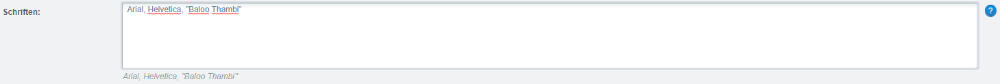

Das Schriften Textfeld erwartet die gewünschten Schriften komma getrennt,
wobei der letzte Wert kein Komma haben darf.

Die Eingabe entspricht dabei den Namen der Schriftdatei welche Du im
`assets/fonts/` Verzeichnis hinterlegt hast.

Dateinamen welche leerzeichen enthalten müssen mit Hochkommata maskiert
werden, also bspw. `"Neue Helvetica STD"`.

### Toolbox

Die hundert und eine Option um ein Toolbox Element zu aktivieren, helfen
Dir den Editor individuell mit neuer Funktionalität auszustatten. Ein
Toolbox Element wird dabei im Editor auf der Linken Seite dargestellt,
es existieren jedoch verschiedene Elemente:

#### Hintergrund

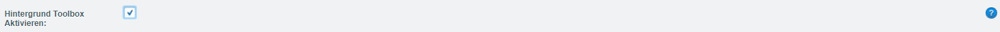

Wenn Du dieses Auswahlfeld aktivierst wird das Hintergrund Toolbox Element
im Editor dargestellt:

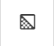

#### Absatz

Wenn Du dieses Auswahlfeld aktivierst wird das Absatz Toolbox Element
im Editor dargestellt:

#### Ellipse

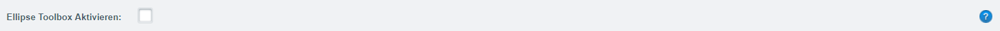

Wenn Du dieses Auswahlfeld aktivierst wird das Ellipse Toolbox Element
im Editor dargestellt:

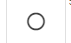

#### Bild

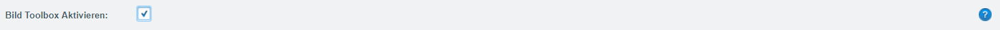

Wenn Du dieses Auswahlfeld aktivierst wird das Bild Toolbox Element
im Editor dargestellt:

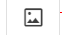

#### Linien

Wenn Du dieses Auswahlfeld aktivierst wird das Linien Toolbox Element
im Editor dargestellt:

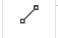

#### Liniear Barcode

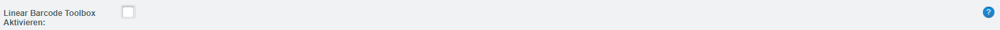

Wenn Du dieses Auswahlfeld aktivierst wird das Linear Barcode Toolbox Element
im Editor dargestellt:

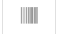

#### QrCode

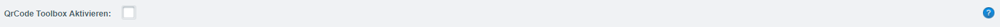

Wenn Du dieses Auswahlfeld aktivierst wird das QrCode Toolbox Element
im Editor dargestellt:

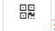

#### Rechteck

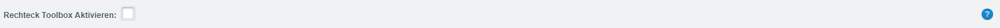

Wenn Du dieses Auswahlfeld aktivierst wird das Rechteck Toolbox Element
im Editor dargestellt:

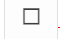

#### Rich Text

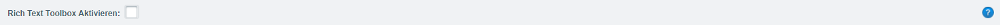

Wenn Du dieses Auswahlfeld aktivierst wird das Rich Text Toolbox Element
im Editor dargestellt:

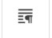

### Sprache
### Wasserzeichen
### Editor Aktivieren
### Min. DPI
### Hintergrund
### Maske
### Vorschau
### Zusätzliche Templates

## Warenkorb

## Bestellung

## Status Dateien