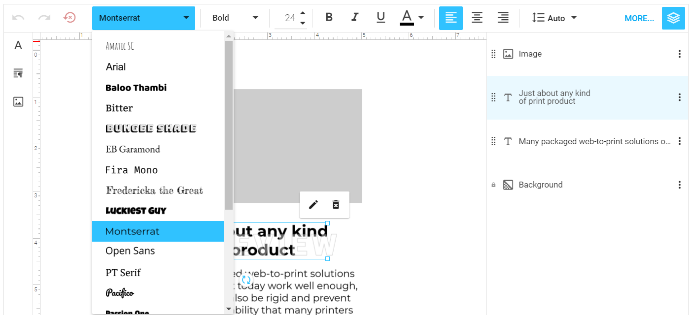
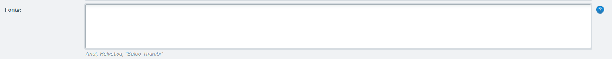

# {{$page.title}}

## Einleitung

Schriften helfen uns die Gestaltung und Lesbarkeit zu erhöhen. Dabei 
existieren verschiedene Schriftschnitte wie bspw. Sans-Serif, Serif oder
Monospace Schriften - diese Begriffe sollten jedoch nichts neues für 
Dich sein. Auch beim Schrifttyp gibt es eine Grosse Auswahl an Dateiendungen
welche für verschiedene Ausgabeformate optmiert wurden. Die bekanntesten
Schrifttypen sind dabei OpenType (`.otf`), TrueType (`.ttf`) und  WebOpen 
(`.woff`) Schrifttypen und all diese Formate werden von Customers Canvas 
unterstützt.

## Schriftliste

Schriften stehen im Editor als Auswahlfeld für Textelemente zur Verfügung. 
Dabei wird die entsprechende Schrift gleich mit einem Beispieltext dargestellt:

## Schrift Hochladen

Alle Schriften müssen als Datei in Deine Customers Canvas Anwendung 
hochgeladen werden. Hierzu verwendest Du das `/assets/fonts/` Verzeichnis.
Daruin hier findest Du alle verfügbaren Schriften.  

Der Name der Schriftdatei entspricht dabei dem Namen, welchen Du später 
im Artikel hinterlegen wirst. Wenn Du also als Namen für die Schriftdatei 
bspw. `BebasNeueBold.otf` verwendest ist der Name welcher Du später 
verwendest `BebasNeueBold`.

## Editor Schriften

Wie bereits erwähnt können alle Schriften aus dem Schriftenverzeichnis
im Editor angeboten werden. Öffne hierzu einen Artikel und trage die
Schrift im Schriftenfeld ein (`Artikel > Freitext Felder > Schriften`):

Schriften müssen Kommagetrennt eingetragen werden, wobei die letzte Schrift
kein Komma braucht. Also bspw. `Arial, Helvetica, "Helvetica Neue STD"`.

Wenn Du leerzeichen in Deinem Namen verwendest musst Du den Namen in
Hochkammata eintragen also bspw.: `"Bebas Neue Bold"` oder `"Helvetica Neue STD"`.

Um alle verfügbaren Schriften zu verwenden kannst Du das Feld entweder 
leer lassen oder einen Stern (`*`) eintragen.