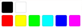

# {{$page.title}}

It all begins with an article. Go to `Items > Create` (`Ctrl+Alt+N`) in 
order to create a new article. Scroll down to the `free text fields` legend
where the print product settings are hosted.


All print product configurations can be found within this legend. Lets 
review the settings and fill them with some dummy data.

## Editor Colors

This field is meant to set the colors available within the editor's color
picker widget. Here is an example of how to determine colors:

```
[
    ["rgb(0, 0, 0)","rgb(255, 255, 255)"],
    ["cmyk(0, 1, 1, 0, 1)","cmyk(0%, 0%, 100%, 0%, 100%)","rgb(0, 255, 0)","rgb(0, 255, 255)","rgb(0, 0, 255)","cmyk(0, 0.9, 0, 0, 1.0)"]
]
```

This setup will render the following colors for the widget:



The first thing that pokes around my head are the color definitions. As you 
can see you can choose which colorspace (CMYK, RGB or Spot Colors) can be used.

**CMYK**: `"cmyk(1, 1, 1, 100, 100%)"`  
1 = 1% Cyan  
1 = 1% Magenta  
1 = 1% Yellow  
100 = 100% = Key  
100% = 100% = Alpha Channel

**RGB**: `"rgb(0, 0, 0)"`  
0 = 0% = Red  
0 = 0% = Green  
0 = 0% = Blue

**Spot Color**: `"spot(PANTONE Rubine Red C, cmyk(30%,100%,90%,36%,100%), 1, 100%)"`  
PANTONE Rubine Red C = Color Name  
cmyk(30%,100%,90%,36%,100%) = Color  
1 = Solidity  
100% = Tint

Maybe you have noticed that we can use `[]` in order to group colors. Everything
must be wrapped within the main Group. Each group can than separately defined
using the group. A group must be separated by comma, the last item of the group
doesn't use a comma.

## Initial Page